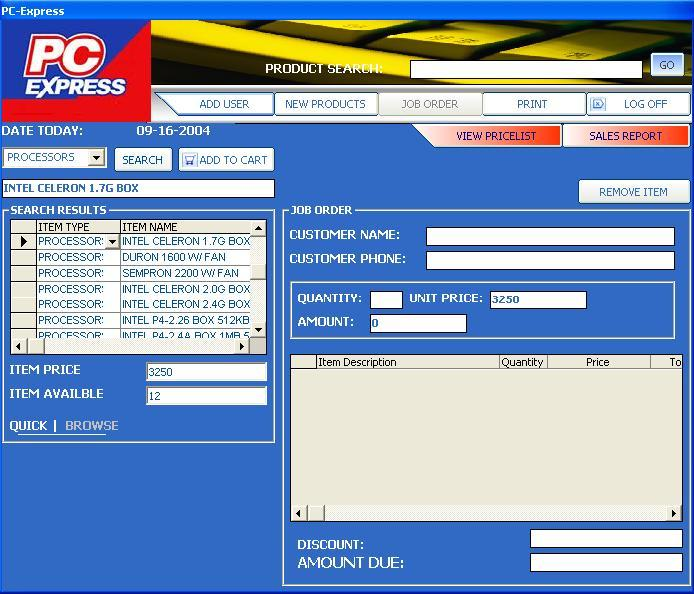



## PC PART INVENTORY

### Description

Good for beginners who want to learn database. I include simple code in searching,add,edit,delete,print in the system. It has good GUI.JUST TRY!!!
 
### More Info
 
COPY THE THE PCX FOLDER TO YOUR VB98 folder @

C;/Program Files/Microsft Visual Studio/Vb98

             |
---                |---
**Submitted On**   |2004-09-15 18:05:28
**By**             |[carbign](https://github.com/Planet-Source-Code/PSCIndex/blob/master/ByAuthor/carbign.md)
**Level**          |Advanced
**User Rating**    |4.3 (13 globes from 3 users)
**Compatibility**  |VB 6\.0
**Category**       |[Databases/ Data Access/ DAO/ ADO](https://github.com/Planet-Source-Code/PSCIndex/blob/master/ByCategory/databases-data-access-dao-ado__1-6.md)
**World**          |[Visual Basic](https://github.com/Planet-Source-Code/PSCIndex/blob/master/ByWorld/visual-basic.md)
**Archive File**   |[PC\_PART\_IN1794379162004\.zip](https://github.com/Planet-Source-Code/carbign-pc-part-inventory__1-56208/archive/master.zip)

